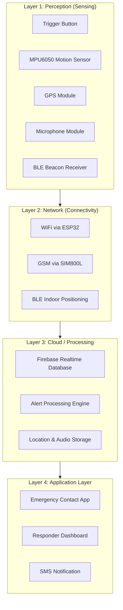
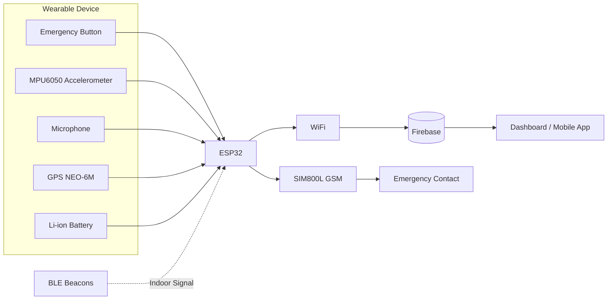
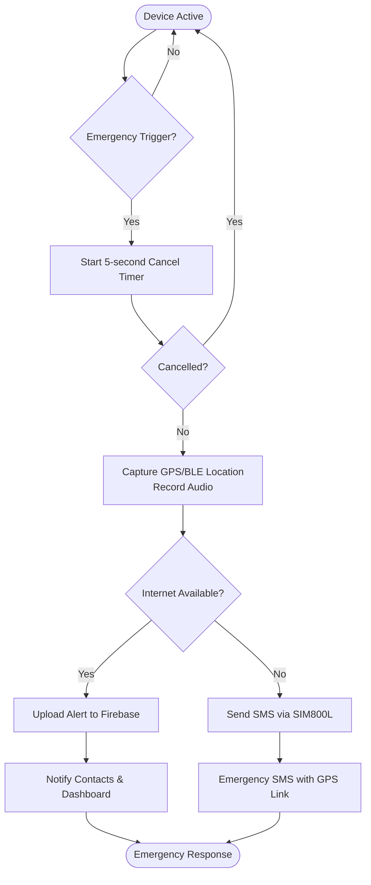

# SafePulse
Smart Wearable Personal Safety &amp; Emergency Response System using ESP32
# SafePulse — Smart Wearable Personal Safety & Emergency Response System

> A smart IoT-based wearable that enables users to silently send emergency alerts without unlocking a phone, making a call, or speaking.

---

## Overview

**SafePulse** is a wearable personal safety system designed to provide rapid emergency assistance during situations where accessing a smartphone may not be possible.

The device allows users to discreetly trigger an emergency alert through either a long button press or a predefined shake gesture. It captures the user's location, records a short audio clip for context, and immediately notifies emergency contacts through cloud services or GSM fallback.

---

## Problem Statement

In many emergency situations, victims may be unable to:

- Unlock their phone
- Dial emergency services
- Speak during a phone call

Traditional emergency systems rely heavily on these actions.

**SafePulse** bridges this gap by providing a wearable, silent, and reliable emergency response mechanism.

---

## Key Features

- **Silent Emergency Trigger**
  - Long-press button
  - Hidden shake gesture

- **Reliable Connectivity**
  - WiFi communication through ESP32
  - GSM (SIM800L) fallback when internet is unavailable

- **Location Tracking**
  - GPS for outdoor positioning
  - BLE beacons for indoor positioning

- **Audio Context Capture**
  - Records a short audio clip during an emergency

- **False Alarm Prevention**
  - 5-second cancellation window before sending alerts

- **Heartbeat Monitoring**
  - Detects unexpected device failure
  - Alerts if the wearable becomes inactive

---

# System Architecture



---

# Block Diagram



---

# Working Flow



---

# Hardware Components

| Component | Purpose |
|------------|----------|
| ESP32 | Main microcontroller with WiFi & Bluetooth |
| MPU6050 | Motion sensing for shake detection |
| GPS NEO-6M | Outdoor location tracking |
| SIM800L | GSM communication fallback |
| BLE Beacons | Indoor positioning |
| Microphone Module | Audio evidence capture |
| Li-ion Battery | Portable power supply |

---

# Software Stack

- Arduino IDE
- ESP32 Framework
- Firebase Realtime Database
- TinyGPS++
- Adafruit MPU6050 Library
- MQTT / HTTP Communication
- Wokwi Simulator (optional)
- Web / Android Dashboard

---

# Repository Structure

```
SafePulse/
│
├── README.md
├── firmware/
│   └── safepulse_firmware.ino
│
├── diagrams/
│   ├── system-architecture.mermaid
│   ├── block-diagram.mermaid
│   └── working-flow.mermaid
│
├── docs/
│   └── SafePulse_Technical_Report.pdf
│
└── LICENSE
```

---

# Getting Started

### 1. Install Arduino IDE

Install Arduino IDE and add ESP32 board support through the Boards Manager.

### 2. Install Required Libraries

- Adafruit MPU6050
- Adafruit Unified Sensor
- TinyGPSPlus

### 3. Configure the Project

Update the following values in the firmware:

- WiFi SSID
- WiFi Password
- Firebase URL
- Emergency Contact Number

### 4. Upload the Firmware

Flash the code to an ESP32 board.

Alternatively, simulate the project using **Wokwi**.

---

# Future Enhancements

- AI-based anomaly detection
- Fall detection using sensor fusion
- Live GPS tracking
- Two-way voice communication
- Smartwatch integration
- Battery health monitoring
- Encrypted cloud communication

---

# Estimated Cost

| Component | Approx. Cost (₹) |
|------------|-----------------:|
| ESP32 | 600 |
| MPU6050 | 180 |
| GPS NEO-6M | 650 |
| SIM800L | 500 |
| BLE Beacons | 300 |
| Microphone Module | 90 |
| Miscellaneous | 150 |

**Estimated Total:** **~₹2,470**

---

# Author

**Devadharshini K**

Electronics and Communication Engineering (ECE)  
Rajalakshmi Engineering College

---

## License

This project is intended for educational, research, and prototype development purposes.
